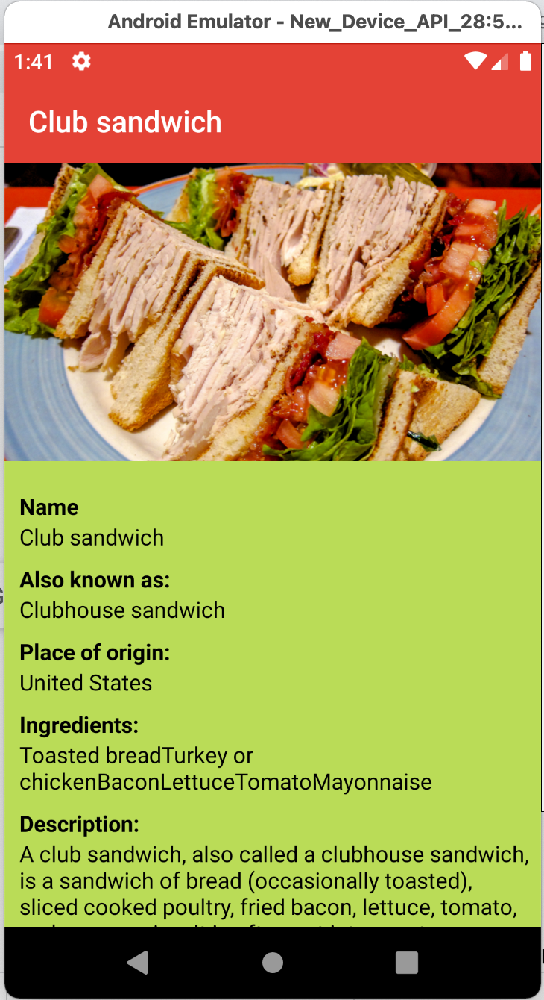

# Sandwich Club 

## Project Overview
Sandwich club app displays the list of sandwiches. When an item is clicked from the list, it shows the details of the particular sandwich that is selected in another activity.

The dummy JSON data is stored in the strings.xml file. JSON parsing has implemented in JsonUtils.java file to populate the UI.

# Sandwich App Homescreen

<table>
  <tr>
    <td></td>
    <td></td>
    <td></td>
  </tr>
<table>
